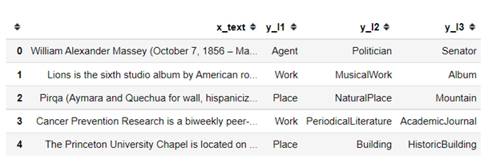

# TL;DR

There are multiple approaches to solve a Hierarchical Multi-Level Classification (HMLC) problem and the best approach cannot be guessed before hand. This accelerator finds the best approach in such a situation. Usage is fairly simple, once the HMLC() class is imported. HMLC() is a class with similar api as sklearn.ensemble module (https://scikit-learn.org/stable/modules/classes.html?highlight=ensemble#module-sklearn.ensemble) 

# Hierarchical Multi-Level Classification

Hierarchical Multi-Level Classification is a classification, where a given input is classified in multiple levels, with a hierarchy amongst them. It is easier to explain it by walking through progressively more complex tasks: binary classification, multi-class classification, multi-level classification, and finally hierarchical multi-level class classification.

## Binary Classification
In a binary classification the task is to classify a given input into one of two classes. Spam filters are a good example, which classify every email into "junk" or "not-junk". Many classifiers used in medicine have a similar structure: classify the given input into "disease detected" or "no disease detected". Fraud detection models and credit risk models (whether to extend credit or not) are other examples.

## Multi-Class Classification
In multi-class classification, the number of classes are more than two. The Iris dataset (https://archive.ics.uci.edu/ml/datasets/Iris) where based on four features (sepal length, sepal width, petal length and petal width), each flower needs to be classified into one of three classes of Iris plants. Most classification problems are usually multi-class classification problems. Examples includes character recognition models, image classification models, topic or document classification models and segmenting customers into different cohorts.

## Single Level vs. Multiple Levels
It is important to distinguish between 'class' and 'level'. The above-mentioned multi-class classification has a single level. In some cases, multiple labels may be attached to a given input. For instance, a given article might be categorized as belonging to 'Sports', 'Afghanistan', and 'Feminism'. These problems are Multi-Level Classification or Multi-Label Classification problems. Another example is detecting objects in a photograph, which could have a 'Dog', 'Cat', and a 'Car'. Sometimes, the number of levels are limited; at other times, the number of levels are fixed. It is also seen that to accommodate an unknown number of levels, a large number of levels are provisioned but many of them could be simply nulls. This is seen in the Brazilian legislation dataset available in this accelerator.

## Hierarchy among levels
It is also possible that there is a hierarchy among levels. This is a special case of Multi-Class Classification. Five examples are given in the next section, which make these problems clear.

# Approaches

## Chained Models
At the highest level, say l1, classification is based on given input; in the next level, l2, both input and output of the model at l1, are taken as inputs; at l3, input and output of model at l2 are taken as inputs, and so on.

## Independent Models 
At each level, classification is done independently, based solely on the input.

## Powerset Models
Classification at all the levels are concatenated reducing the problem to a single level classification problem.

# Datasets

This section introduces publicly available sample datasets involving Hierarchical Multi-Level Classification (HMLC). These have been compiled in order to test the HMLC Accelerator. The datasets covered are:
•	DBPedia Dataset – Classification of Subject Matter
•	Product Classification based on Amazon Reviews
•	Offensiveness Classification of Tweets
•	Classification of Brazilian Legislation
•	Classification of Geo-chemical Layers from Bushveld
 
These are described briefly in the sub-sections that follow along with a link to the source. Some of the datasets have been processed a bit to get them into the format expected by the HMLC Accelerator. Snapshots of sample data are also reproduced. Fuller details are available in the source.

## DBPedia Dataset – Classification of Subject Matter

Description: This dataset contains 342k rows. In each row, the input is a text – an entry in Wikipedia – is classified in three levels. The first level categories of ‘Work’, ‘Place’ etc. have sub-categories such as ‘NaturalPlace’ and ‘Building’ in the second level, under ‘Work’. The third level is a more specific category such as ‘Moutain’ or ‘HistoricalBuilding’.

Snapshot: 

Source: https://www.kaggle.com/danofer/dbpedia-classes

Number of Levels: 3 (9, 70 and 219 classes in Levels 1, 2 and 3 respectively). Classes in level 3 are unique across Level2 categories. Therefore, this is equivalent to a single-level, multi-class classification problem.

Input: Text (Wikipedia entry) 342,782 rows.

## Product Classification based on Amazon Reviews

Description: Based on the text of reviews in Amazon, the task is to identify three levels of hierarchical categories, as seen in the sample rows below.

Snapshot: 

Source: https://www.kaggle.com/kashnitsky/hierarchical-text-classification

Number of levels: 3 (Level 1 classes are: health personal care, toys games, beauty, pet supplies, baby products, and grocery gourmet food.)

Nature of input columns: Text, primarily. Numerical and Categorical columns are also available.

## Offensiveness Classification of Tweets

*Caution: This dataset contains curse words and offensive language.*

Description: At the first level tweets are classified as Offensive and Not; Offensive tweets are further classified as Targeted Insults & Threats and Untargeted. In the third level, Targeted  Insults & Threats are further classified into those targeted at Individual, Group or Other

Snapshot:

Source: https://www.kaggle.com/feyzazkefe/olid-dataset

Number of levels: 3 (L1 - Offensive / Not offensive; L2 - Targeted Insults & Threats / Untargeted; L3 - Individual / Group / Other). The dataset requires some pre-processing.

Input column: Text (tweets) 

## Classification of Brazilian Legislation

Description: This contains details of Brazilian Legislation classified into Themes (Tema) and five further sub-classifications. The text is in Portuguese. One feature of this dataset is that a large number of NaNs occur in the sub-categories as shown below:

Snapshot:

Source: https://www.kaggle.com/fabiobcgomes/brazilian-bills-of-law-2011-2014?select=Readme.txt

Number of Levels: 6 - but some of these can be NULL.

Input: Primarily text (in Portugese)

## Classification of Geo-chemical Layers from Bushveld
Description: The Bushveld Complex (in South Africa), the largest layered mafic-ultramafic intrusion worldwide, is host of numerous, laterally continuous and chemically similar chromitite layers. Based on their stratigraphic position the layers are subdivided into a lower, middle and upper group (LG, MG and UG). Within these groups the layers are numbered successively – from the base to the top of each group. Based on the chemical composition, the requirement is to classify the layer.

Snapshot:

Number of Levels: 2 (Level One has two classes LG & MG; Level Two has 1, 2, 3, 4, 5, 6, 6A & 7 for LG and 1, 2, 3, 4, 4A and 4Zero for MG; but the two levels are concatenated without any space or gap)

Input data: Mainly numerical, one text column (which can be treated as categorical as well)

# Usage

*class* HMLC(time_limit=30, ngram=(1, 1), stop_words='english', estimators_, methods, additional_colms=[], validation_split=0.2, max_features=5000, token_pattern=r'([a-zA-Z0-9/+-]{1,})', abbr_dict={}, df_pred=pd.DataFrame())

Paramters:

time_limit: float, default = 30\
Maximum time, in minutes, beyond which search for the best approach should terminate.

ngram: tuple, default = (1, 1)\
parameter "ngram_range" in TdifVectorizer class of Sklearn (https://scikit-learn.org/stable/modules/generated/sklearn.feature_extraction.text.TfidfVectorizer.html)

stop_words: str, default = 'english'\
parameter "stop_words" in TdifVectorizer class of Sklearn (https://scikit-learn.org/stable/modules/generated/sklearn.feature_extraction.text.TfidfVectorizer.html)

estimators_: ['lrc', 'knn', 'dtc', 'gnb', 'mnb', 'rfc', 'abc', 'gbc', 'etc'], default = ['rfc', 'etc', 'gnb']\
Sklearn estimators.\
'knn': sklearn.neighbors.KNeighborsClassifier(n_neighbors=3)\
'dtc': sklearn.tree.DecisionTreeClassifier(max_leaf_nodes=8, random_state=13)\
'gnb': sklearn.naive_bayes.GaussianNB()\
'mnb': sklearn.naive_bayes.MultinomialNB()\
'rfc': sklearn.ensemble.RandomForestClassifier(n_estimators=100, max_depth=3, random_state=13)\
'abc': sklearn.ensemble.AdaBoostClassifier(base_estimator=DecisionTreeClassifier(max_depth=3), n_estimators=200, learning_rate=0.5, random_state=13)\
'gbc': sklearn.ensemble.GradientBoostingClassifier(n_estimators=100, learning_rate=0.5, max_depth=2, random_state=13)\
'etc': sklearn.ensemble.ExtraTreesClassifier(n_estimators=50, random_state=13)\
'lrc': sklearn.linear_model.LogisticRegression()\

methods: ['independent_models', 'chained_models', 'powerset_models'], default = ['independent_models', 'chained_models', 'powerset_models']\
'independent_models': at each level, classification is done independently, based solely on the input.\
'chained_models': at the highest level, say l1, classification is based on given input; in the next level, l2, both input and output of the model at l1, are taken as inputs; at l3, input and output of model at l2 are taken as inputs, and so on.\
'powerset_models': classification at all the levels are concatenated reducing the problem to a single level classification problem.

additional_colms: list, default = []\
columns in addition to the input columns which need to be considered in training a particular model.

validation_split: float, default = 0.2\
fraction of the dataset which should be set apart for validating the model.

max_features: int, default = 5000\
parameter "max_features" in TdifVectorizer class of Sklearn (https://scikit-learn.org/stable/modules/generated/sklearn.feature_extraction.text.TfidfVectorizer.html)

token_pattern: str, default = r'([a-zA-Z0-9/+-]{1,})'\
parameter "token_pattern" in TdifVectorizer class of Sklearn (https://scikit-learn.org/stable/modules/generated/sklearn.feature_extraction.text.TfidfVectorizer.html)

abbr_dict: dict, default = {}\
dictionary with key: given_value, value: substitute_value to be used for replacing 'given_value's with 'substitute_value's while preprocessing columns containing only text. Useful to expand abbreviations ({abbreviation: expansion}), or indicating equivalent words (example: {'colour': 'color', 'clr': 'color'}).
 

df_pred: pandas dataframe, default = pd.DataFrame()\
dataframe into which predictions would be populated.

## Methods of HMLC() class
predict(X): predict classes for X

predict_proba(X): predict class probabilities for each class in each level, returns a nested dictionary

score(X, y): return a dictionary containing accuracy and 1 – Hamming Loss for a given test data set and labels

## Attributes of HMLC() class
n_features_: int

Number of features seen during fit.

n_features_in_: int

Number of features seen during fit. Same as n_features_

feature_names_in_: ndarray of shape (n_features_in_,)

Names of features seen during fit. Defined only when X has feature names that are all strings. Returns None otherwise.

estimators_: list of estimators

The collection of fitted base estimators (models)

combination_method_: str 
One of the labels from [“chained_models”, “independent_models”, “concatenated_classes” / “powerset_labels”] (Can be either of the two, i.e. "concatenated_classes" or "powerset_labels")

levels_: int (number of levels).

classes_: dict {level: classes} - The classes labels for each level.

n_classes_: dict {level: number of classes}

# Trademarks
This project may contain trademarks or logos for projects, products, or services. Authorized use of Microsoft trademarks or logos is subject to and must follow Microsoft's Trademark & Brand Guidelines. Use of Microsoft trademarks or logos in modified versions of this project must not cause confusion or imply Microsoft sponsorship. Any use of third-party trademarks or logos are subject to those third-party's policies.
